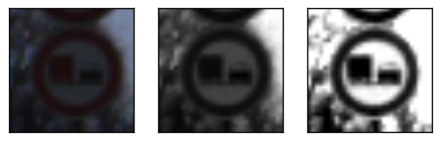
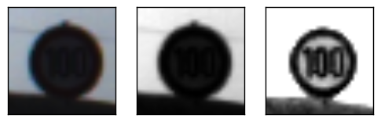

# Traffic-Sign-Classifier
> Please refer to: Self-Driving Car Engineer Nanodegree - Udacity, [Term 1 - Project 2](https://github.com/udacity/CarND-Traffic-Sign-Classifier-Project)

### Overview
This project uses a deep convolutional neural networks to classify traffic signs. 
The CNN model takes as input the [German Traffic Sign Dataset](http://benchmark.ini.rub.de/?section=gtsrb&subsection=dataset) and understands road signs from images. The [notebook](Traffic_Sign_Classifier.ipynb) shows the code as well full results.   

### Dependencies
The code is stored in a [Jupyter Notebook](http://jupyter.org/) and requires **Python 3.5**. Please refer to the [project website](https://github.com/udacity/CarND-Traffic-Sign-Classifier-Project) for implementation details. 

### Preprocessing
The project pipeline includes functions to transform poor colors in high contrast grey images. E.g.:  

* _No passing_  

* _Speed limit_  

### Results
At the end, with this CNN model you can obtain the following accuracy:
* training set: near 100%  
* validation set: 94%  
* test set: 85%
